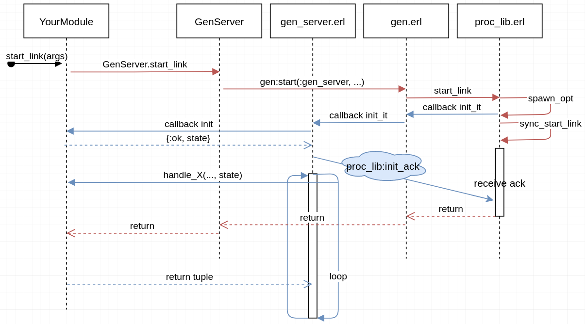

# GenServer - blocking init

Now that we know the absolute basics of a GenServer, it's time to go a little more in-depth regarding the `init\1` callback and later on the `handle_continue` callback.

## General overview

Let us create a very simple genserver, ignoring calls, casts, messages and so on.

```elixir
defmodule Demonstration do
  use GenServer
  @me __MODULE__

  def start_link(args \\ []), do: GenServer.start_link(@me, args, name: @me)

  def init(_args) do
    {:ok, :initial_state}
  end
end
```

Quite simple right? A very simple GenServer that is initialized with the `:initial_state` state. But sometimes, we'll want to do a very long computation before we will start processing messages. This could be one of the following reasons:

* IoT context: read sensor data
* Web-related context: access API for initial data
* General context: Read a very large files
* Distributed context: see what's running on other nodes
* and so on....

This could have unintentional side effects, such as other processes suffering because of this. To exactly understand what this means, we'd need to understand supervisors as well so feel free to ignore this right now. _(for those who know the basics of supervisors, the next process in the children list is only started after the previous process its init callback is finished.)_

## The blocking init callback

You'll sometimes see the statement "A GenServer its init callback is blocking". In order to understand what exactly is meant by that, let us alter the previous code so that it takes a reaaaaally long time to finish.

```elixir
defmodule Demonstration do
  use GenServer
  @me __MODULE__

  def start_link(args \\ []), do: GenServer.start_link(@me, args, name: @me)

  def init(_args) do
    :timer.sleep(10_000)
    {:ok, :initial_state}
  end
end
```

Put it either directly in your iex (or do it with the .exs where you compile a .ex file manually, up to you) and start the GenServer with `Demonstration.start_link`. Wow! That takes a long time doesn't it? So what's happening here?

Elixir GenServers use Erlang its gen_server module internally. The next section is only to give an in-depth understanding as to why the `GenServer.start_link` returns until the init is finished.

## Diving into the unknown

### GenServer implementation

First let us take a look at the [GenServer implementation in Elixir](https://github.com/elixir-lang/elixir/blob/master/lib/elixir/lib/gen_server.ex):

```elixir
# elixir/lib/gen_server.ex
  # GenServer.start_link
  def start_link(module, init_arg, options \\ []) when is_atom(module) and is_list(options) do
    do_start(:link, module, init_arg, options)
  end

  # GenServer.start
  def start(module, init_arg, options \\ []) when is_atom(module) and is_list(options) do
    do_start(:nolink, module, init_arg, options)
  end

  defp do_start(link, module, init_arg, options) do
    case Keyword.pop(options, :name) do
      # No name registration
      {nil, opts} ->
        :gen.start(:gen_server, link, module, init_arg, opts)

      # Atom name registration
      {atom, opts} when is_atom(atom) ->
        :gen.start(:gen_server, link, {:local, atom}, module, init_arg, opts)
    # ...
```

This is quite a lot of code, but let us take it step by step. The first 2 functions are basically just the `GenServer.start` and `GenServer.start_link` API functions. Internally, they will call upon the private `do_start` function.

The `do_start` function will format the provided arguments to the required argument notation that Erlang its API exposes. To put it simply, Elixir provides a nice, clean, obvious syntax wrapper to Erlang its overwhelming API with nice and clear documentation. _(No offense or rudeness intended at all towards the Erlang programming language.)_

The `case` macro beneath that is for the name registration. It'll detect whether name registration is necessary and format the parameters / tuples so that Erlang understands what you're trying to do.

Do note that Elixir its `GenServer` module does __not__ call Erlang its `gen_server`, __but its `gen` module directly!__ Though it does pass the `gen_server` module as callback information. That's because the actual abstraction of the genserver-related behaviours are there. _Tip: Look at the sequence diagram at the end of this file_

Next up is some Erlang code. Don't worry, you don't need to be an Erlang programmer to understand the next part.

### Erlang its gen.erl - starting a process

This Erlang module abstracts away the really generic stuff of the generic standard behaviours. Let us take a look at how we some parts look like. First we'll look at how it starts a process.

_Note: `?MODULE` is the same as Elixir its `__MODULE__`_

```erlang
% gen.erl
start(GenMod, LinkP, Mod, Args, Options) ->
    do_spawn(GenMod, LinkP, Mod, Args, Options).

do_spawn(GenMod, link, Mod, Args, Options) ->
    Time = timeout(Options),
    proc_lib:start_link(?MODULE, init_it,
            [GenMod, self(), self(), Mod, Args, Options],
            Time, spawn_opts(Options));
do_spawn(GenMod, _, Mod, Args, Options) ->
    Time = timeout(Options),
   proc_lib:start(?MODULE, init_it,
            [GenMod, self(), self, Mod, Args, Options],
            Time, spawn_opts(Options)).
```

We can see that when the `start` function is called, internally the `do_spawn` function is executed. In this function, `:proc_lib.start` or `:proc_lib.start_link` is executed.

### Erlang proc_lib - starting a process

When you look at the arguments that are given in `gen.erl` to proc lib, we see that the current module (`?MODULE`) and the `init_it` function is given. This is a callback function which needs to be completed. Let us go one level deeper into the proc_lib library and take a look at its `start_link` function:

```erlang
% proc_lib.erl
start_link(M,F,A,Timeout,SpawnOpts) when is_atom(M), is_atom(F), is_list(A) ->
    % ignoring overwhelming code
    % Note: Feel free to assume that spawn_opt is the same as :erlang.spawn
    %   + rewrote it a little bit to make it more readable
    SpawnedPid = ?MODULE:spawn_opt(M, F, A, [link|SpawnOpts]),
    sync_start_link(SpawnedPid, Timeout).

sync_start_link(Pid, Timeout) ->
    receive
    {ack, Pid, Return} ->
            Return;
    {'EXIT', Pid, Reason} ->
            {error, Reason}
    after Timeout ->
            kill_flush(Pid),
            {error, timeout}
    end.
```

Here we can finally see that we spawn the process. Keep in mind that the function is called with the `gen` module and `:init_it` callback function as parameters. Which means that the newly spawned process will execute this function. There are still some things that are abstract, but let us just assume that this process, the caller process who just created the new process, expects a  `{ack, pid, return}` message that basically says "Hey you, I started up without any problems!".

_Note: It will not yet execute YourModule init function! This is the `init_it` function of our `gen.erl` module._

### New process: `gen.erl` its `init_it` callback function

Now that we know that the process is created, let us go back to the `gen.erl` module where the __newly created process will execute__ the `init_it/6` function:

```erlang
% gen.erl
init_it(GenMod, Starter, Parent, Mod, Args, Options) ->
    init_it2(GenMod, Starter, Parent, self(), Mod, Args, Options).

init_it(GenMod, Starter, Parent, Name, Mod, Args, Options) ->
    case register_name(Name) of
    true ->
        init_it2(GenMod, Starter, Parent, Name, Mod, Args, Options);
    {false, Pid} ->
        proc_lib:init_ack(Starter, {error, {already_started, Pid}})
    end.

init_it2(GenMod, Starter, Parent, Name, Mod, Args, Options) ->
    GenMod:init_it(Starter, Parent, Name, Mod, Args, Options).
```

Here we can see that the newly spawned process will execute `init_it`, which will internally execute the `init2` function. This will once again call the previously passed `genserver` module its `init` function.

### New process: `gen_server.erl` its `init_it` callback function

We are finally in our Erlang its `gen_server` module. Do you remember how? Elixir its `GenServer` module passed this directly to our `gen` module. Now our newly spawned process will finally execute this code! In `:gen.init__it2` the `gen_server` its `init_it` function is called directly. Let us look at what is happening there:

```erlang
% gen_server.erl
init_it(Starter, Parent, Name0, Mod, Args, Options) ->
    % ignoring overwhelming code

    case init_it(Mod, Args) of
        {ok, {ok, State}} ->
            proc_lib:init_ack(Starter, {ok, self()}),
            loop(Parent, Name, State, Mod, infinity, HibernateAfterTimeout, Debug);
        {ok, {ok, State, Timeout}} ->
            proc_lib:init_ack(Starter, {ok, self()}),
            loop(Parent, Name, State, Mod, Timeout, HibernateAfterTimeout, Debug);
        % Other return values....
    end.

% This is called in the previous init_it/6 function!
init_it(Mod, Args) ->
    try
        {ok, Mod:init(Args)}
    catch
        throw:R -> {ok, R};
        Class:R:S -> {'EXIT', Class, R, S}
    end.
```

This is where we will finally understand why our init call is blocking. Look at the first `init_it/6`. These clauses are called upon by the newly started process. There is a `case` statement which will call upon another `init_it/2` (look at the arity!) function that's defined below. This will, once again, call the `init` function of the given module. Which in this case is YourModule.

Remember that the `init` function in our Elixir code can return `{:ok, initial_state}`? Imagine this tuple being returned in the try ... catch clause of the `gen_server.erl` its `init/2` function. Which then will match the first clause of the above `case` function. There we see that `proc_lib:init_ack` is executed! This will send an acknowledgement to our caller process saying "Hey, we're good here! Go ahead!".

Just to point out where our caller process is waiting:

```erlang
% proc_lib.erl
sync_start_link(Pid, Timeout) ->
    receive
    {ack, Pid, Return} ->
            Return;
    {'EXIT', Pid, Reason} ->
            {error, Reason}
    after Timeout ->
            kill_flush(Pid),
            {error, timeout}
    end.
```

This return result is passed back all the way back up to our caller, in this case probably `YourModule.start_link`. It'll most likely return `{:ok, PID}` assuming everything went without any problems.

Phew. That was a long trip. Now we understand why exactly an `init` call is blocking.

## Overview init code execution



Next up, you definitely should read why [`handle_continue`](./03_handle_continue.md) is interesting, if not an absolute necessity in some situations!
